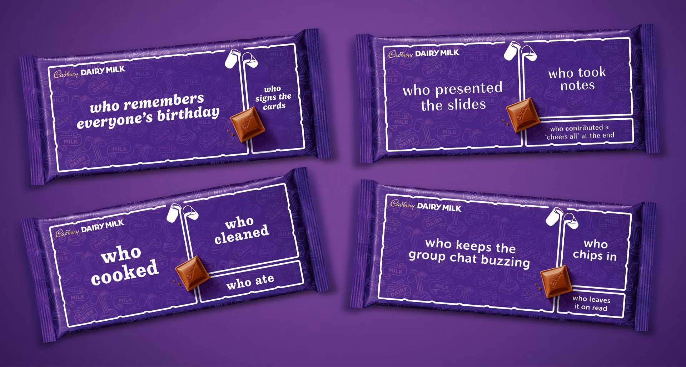

# Examples

## Example 1

7 harsh truths employees need to know.

### **If you’re an employee, these are the 5 most brutal facts your boss is hoping you never learn.**

- Aligns slightly with the employee | Broad Reaching | Many Views

TEXT HOOK: 5 Things your BOSS is HIDING from you.

TEXT HOOK: 5 Facts Your BOSS HATES

### I won’t promote an employee, no matter how great they are, if they haven’t worked out these 5 things.

- Align more with ‘entrepreneur’ | founders | Execs | Business-curious | Freelancers’

TEXT HOOK: 5 REASONS YOU’RE NOT GETTING PROMOTED

TEXT HOOK: 5 TRUTHS KEEPING YOU POOR

### I've been running a company for two years now and these are the 5 worst things that your employer is hoping you never find out. 
// And trust me, this is coming from someone who used to be an employee, now runs a company, and have learned every dirty trick.

- Heavily Aligned on side of employee |

TEXT HOOK: 5 SECRETS COMPANIES KEEP FROM YOU

INSIDER SECRETS #18

TEXT HOOK: 5 Facts Your BOSS HATES 

If you want to stand out and reach your full potential, read this now:

**5.** **Your Job Title Doesn’t Define Your Worth** 

Just because a piece of paper says one thing doesn’t mean it covers everything you do. Make sure you’re actually looking at your responsibilities – and that you’re getting paid fairly for them, not just for the label you’ve been given.

**4. Getting Promoted Is Your Own Responsibility** 

 Look, if you're not already moving up, then your boss doesn’t want you to. Don’t give them that power. You're your own person and you’re in control.

You should be practicing and refining more skills on your own time; so if your boss doesn’t start moving you up, then you’ll outgrow the company anyway.

**3. Work-Life Balance is Actually Completely in Control** 

No one cares about your personal time more than you do. And no one's going to stop messing with it, unless you tell them – and you draw that line.

People treat you how you'd let them. Remember that.

**2. Hard Work Doesn’t Guarantee that you’re going to be recognised for it.**

If you don't speak up and let people know about exactly what  you're providing the company with,  what benefit you're bringing the company, and your successes on whatever projects you're working on, then no one's going to do it for you.

You need to be visible because otherwise, your manager WILL take credit for what YOU are doing.

1. **And, I might get a lot of hate for saying this, but If you’re coasting, you’re falling behind.** 

 You don't just need to always be moving, but always be running and pushing yourself. And if there's not a challenge in your life that's making you stronger Then you're getting weaker, because the competition won’t stop if you do.

Natural Follow-up:

Which one of these are you ignoring?

Wild Card CTA Question: 

Should bosses be allowed to pay people based on their MOTIVATION?

Is Work-Life Balance just a new word for ‘Lazy’?

Should your boss be paid more now that you know these facts?

Let the audience Joke: 

Now you know these facts, your boss has to grant you one wish – what you makin him do 🤔

## Example 2

GREEN SCREEN

Cadbury's new packaging is GENIUS [point hand toward picture ‘behind’ you]

Here’s what you can learn from it, coming from a marketing design specialist.

So this campaign launched last month. And I love it so much. It’s basically all centred around the idea of sharing, the community around Cadbury’s. 

Each bar has a different scenario that people would normally have a share bar in. And a little joke about who deserves more or less of it. 

So  who cooked, who cleaned and who ate. 
Who remembers everyones birthday, who sign the cards. 

Who keeps the group chat buzzing, who chips in and who leaves it on read (that last one is so me)

And my personal favourite: who presented the slides, who took notes, and who contributed a ‘cheers all at the end’ 

[Insert other relevant images, swap out every sentence] 

---

SCROLL WARNING

---

Re-Hook: 

So this is why it’s the sign of a huge shift happening in marketing

Marketing isn’t about the brand anymore, it’s about the consumer. It’s about finding a reality, a dilemma, an experience that the consumer will have and placing your product into it. 

And sharing food, especially chocolate, is never fair. So them approaching this interaction, doubling down on it and making a joke - puts them INTO people’s experience with the product. It positions them as part of that moment between friends, family or strangers. And makes you feel more connected with the brand, without them having to say anything. 

I’d love to see which other campaigns follow up on this. 

Be honest, which square would you be?

- LI post
    
    Here’s why I love it👇🏽
    
    Their redesigned Dairy Milk bar campaign hits every note perfectly - the packaging, the messaging, the thoughtfulness. It's heartwarming - and funny. 
    
    The possibilities this opens for brand storytelling are extraordinary: What if we could maintain that same level of thoughtful design, that perfectly curated message, but extend it to other products and experiences? 
    
    Not just limited-edition packaging, but true, life-like integrations that show appreciation for everyday acts in any context.
    
    The real magic of this campaign isn't just about creating special packaging—it's about giving every customer an authentic reminder of how small acts of kindness make a big difference, all within the brand's curated world.
    
    True appreciation, real connection, genuine warmth.
    
    The future of branding isn't just about what we sell—it's about truly knowing how we can make people feel valued. And how consumers truly interact with your product. 
    
    And I’m here for it 👏🏼
    

## Example 3

- OG LI POST
    
    **I moved into my employee’s house for a week – here’s why.**
    
    I believe in leading from the front.
    
    So when one of my team members told me they were struggling with work-life balance, I didn’t just listen—I packed a bag and moved in.
    
    For one week, I lived their routine. Woke up at their alarm. Sat at their desk. Took calls from their kitchen table. Watched how work blended into personal life in ways I’d never seen before.
    
    And what I learned changed everything.
    
    It wasn’t about time management. It wasn’t about productivity hacks.
    
    It was about **mental load.**
    
    - The pressure of back-to-back meetings with no time to think.
    - The guilt of stepping away, even for lunch.
    - The feeling that if they weren’t “always on,” they weren’t doing enough.
    
    That week made me rethink everything about how we work.
    
    So we made changes.
    
    - **No more pointless meetings.** If it can be a message, it’s a message.
    - **More async communication.** Not everything needs an instant reply.
    - **Real flexibility.** If someone needs to step away at 2 PM to reset, they should.
    
    Because when people have **space** to breathe, they don’t just work better.
    
    They think better. They live better.
    
    I’m not saying every leader should move in with their employees (I wouldn’t wish my snoring on anyone 😅).
    
    But we **do** need to listen. To understand. To make real changes that actually help.
    
    Because when your team thrives, your business thrives.
    
    Would love to hear—what’s one workplace change that made a real difference in your life? Drop it below 👇🏼
    

**I moved into my employee’s house for a week – here’s why.**

So this employee, who is also incidentally my best friend, was struggling with burnout. He works incredibly hard, much harder than me. We’d tried to optimise his workflow to make things easier - but honestly just couldn’t find the bottleneck.

So we decided to live his routine with him - of course it was his idea first 

The first day was a bit weird. Especially as a founder with a very strict routine. But for a full week, I woke up to his alarm, worked at his kitchen table, juggled back-to-back calls—just like he did.

And guess what I learned?

Working from home has actually ruined work life balance. The burn out wasn’t from workload, it was feeling pressured to always be ‘on,’ never daring to step away from the desk - not even for lunch.

And admittedly, I realised I had to adapt the company to fix it. So I made just three changes. 

1. I  killed pointless meetings - (I know I should have done it sooner) if it can be a quick message, it’s a message.
2. I introduced asynchronous comms - no more expecting instant replies.

3.	And 3, I created REAL flexibility. if you need an hour at 2 PM to reset, take it. The team will manage. 

Now we have a better company and a stronger team – but it raises a HUGE question:

Would you ever let your boss move in with you for a week, even if it meant you got nap time?